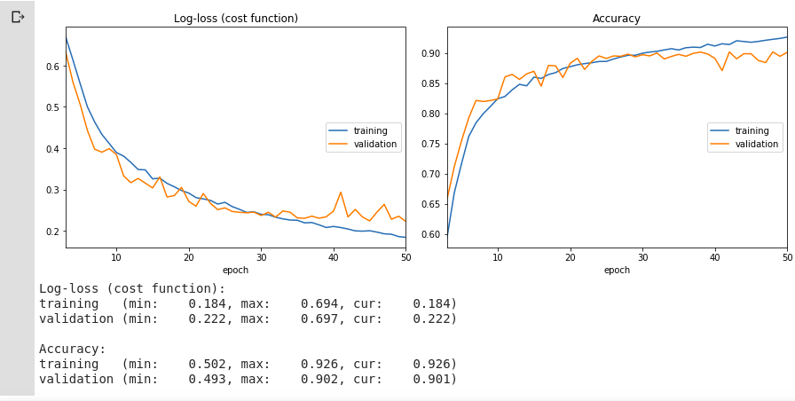

# Image Classifier

Python Jupyter Notebook with **Convolutional Neural Network** image classifier implemented in **Keras** . It's **[Google Colab](https://colab.research.google.com/)** ready.

## Performance

**Dataset:** [Dogs vs Cats](https://www.kaggle.com/c/dogs-vs-cats)

**Description:** Binary classification. Two classes two distinguish - **dogs** and **cats**.

**Training:** 10 000 images per class

**Validation:** 2 500 images per class

### model_1

### model_2

### model_3

### Final Model

